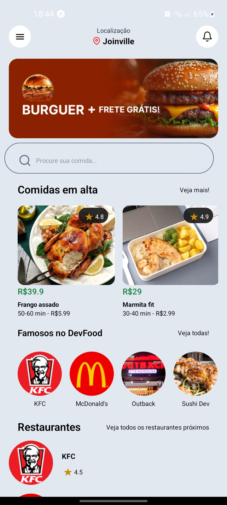
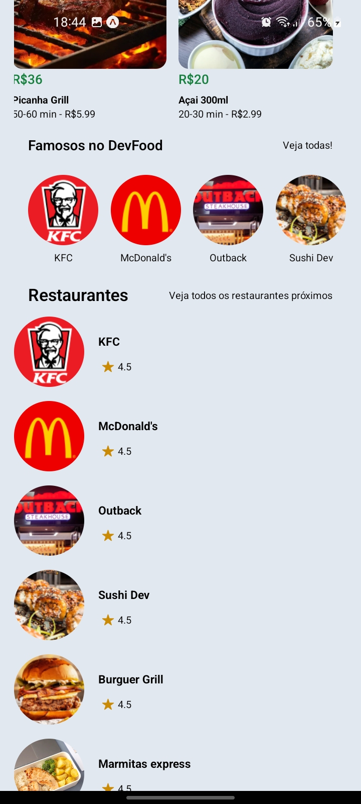

<h2>Menu Food App</h2>

Aplicação desenvolvida para fixar conceitos sobre o React Native

<h3>Tecnologias usadas:</h3>

React Native

Expo

Json Web Server

NativeWind

<h4>Comandos:</h4>

<strong>npm install </strong>para baixar os pacotes necessários

<strong>npm run server </strong>para iniciar o json web server

<strong>npx expo start </strong>para iniciar a aplicação mobile com expo

<h3>Rotas:</h3>
 - /restaurants - Retorna os restaurantes
 - /foods - retorna todas as comidas

<h4>Imagens da aplicação:</h4>

Créditos: Sujeito Programador
